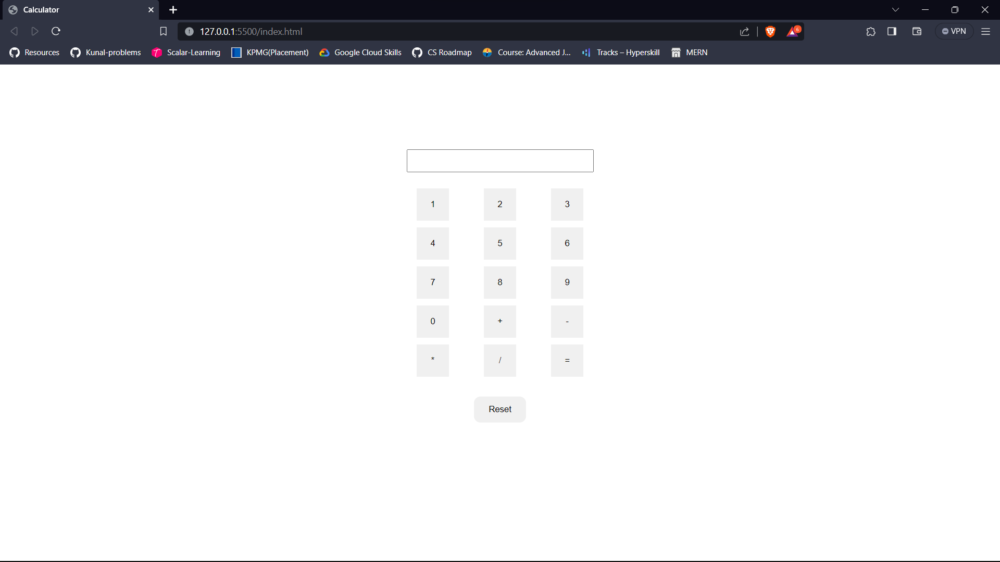

### Day3

- Task is to build a calculator
  - used event listener to calculate the result
  - And also used the key release event listener to listen for each key stroke and implemented the calculation

### Outcome

